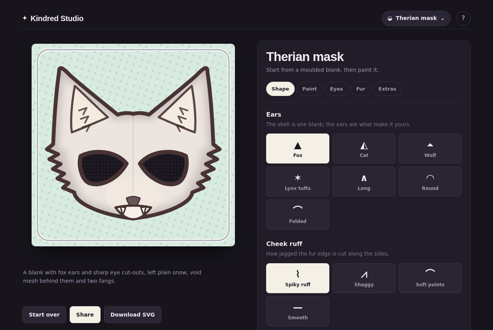
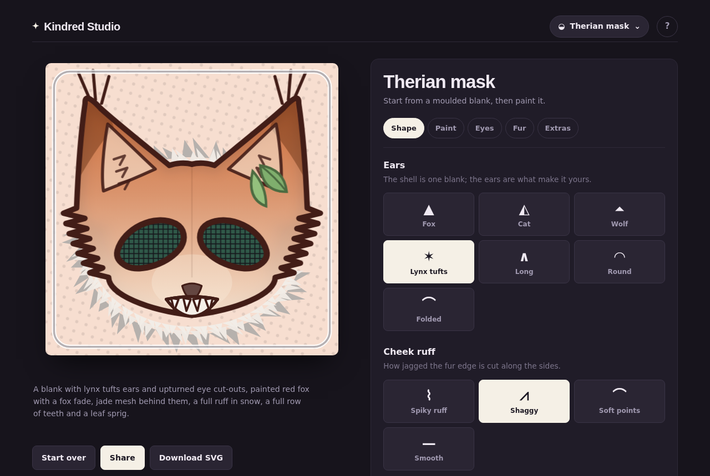
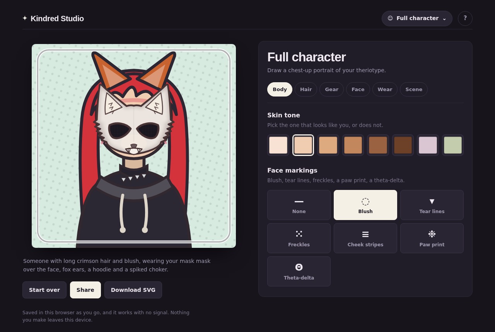
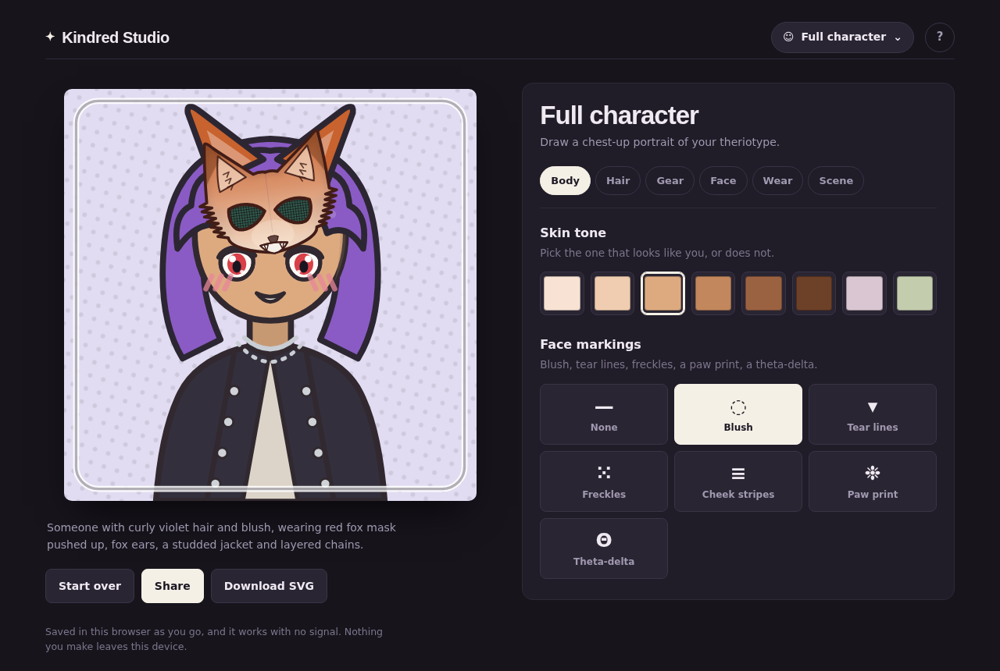
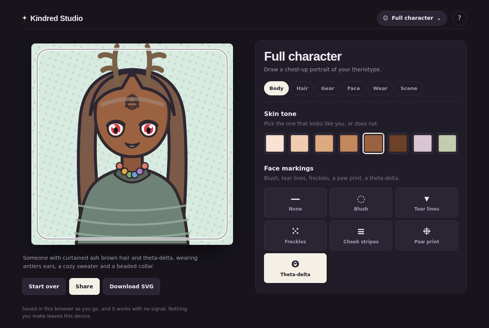
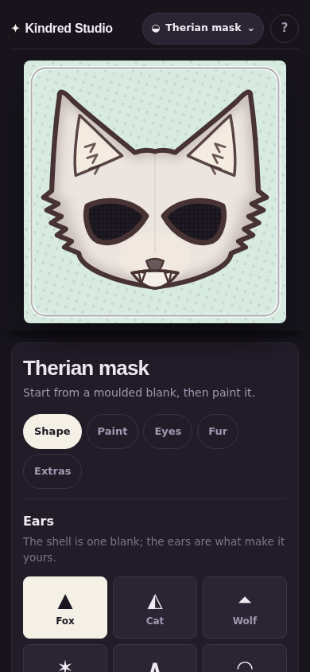
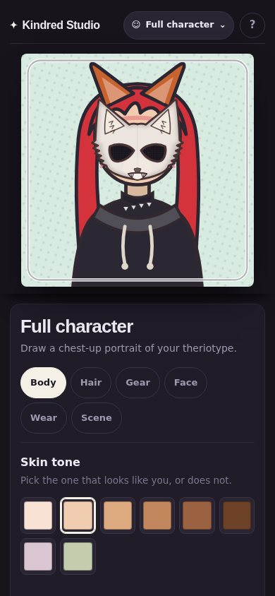
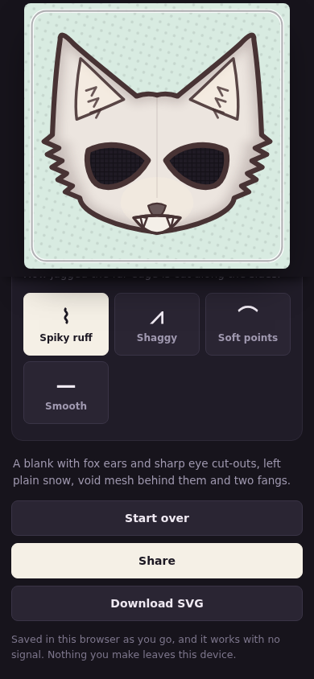

Therian character creator. Supports mobile and offline usage.

# Deployment

Hosted at <https://therian.heywoodlh.io>, deployed from `main` by GitHub Actions
once the tests pass. Point a DNS `CNAME` record for `therian` at
`heywoodlh.github.io.`, then set the custom domain under Settings → Pages and tick
"Enforce HTTPS".

GitHub redirects `heywoodlh.github.io/<repo>/` to the custom domain once that is
set — but the app itself carries no absolute paths, so it also runs correctly from
a sub-path if the custom domain is ever removed or has not propagated yet.

Self-hosting with nginx instead:

```
docker compose build

docker compose up -d
```

The container sends the security headers Pages cannot; the same policy minus
`frame-ancestors` also ships as a `<meta>` tag so it applies either way.

# Screenshots














